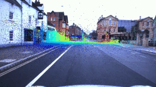

# Projects

Small builds, tools, and side projects.

    

        

            <h3><a href="projects/robotcar-lidar.html" class="publication-link">RobotCar LiDAR Vehicle Detection</a> (2026)</h3>
            
Detect vehicles from sparse LiDAR while preserving throughput; achieved cleaner object separation using Python and point-cloud processing.

            

                Computer Vision
                LiDAR
            

        

        
    

    

        

            <h3><a href="projects/face-recognition.html" class="publication-link">Face Recognition Door Unlock</a> (2026)</h3>
            
Build robust face-based access control with liveness checks; delivered real-time inference with swappable CV/ML backends.

            

                Computer Vision
                ML
            

        

        
    

    

        

            <h3><a href="projects/soft-body-snake.html" class="publication-link">Soft Body Robotic Snake</a> (2023)</h3>
            
Explore compliant locomotion with modular pneumatics and distributed control; demonstrated bio-inspired snake motion on hardware.

            

                Robotics
                Hardware
            

        

    

    

        

            <h3><a href="projects/supermag-api.html" class="publication-link">SuperMAG R API</a> (2022)</h3>
            
Remove friction for space-weather workflows by wrapping SuperMAG data access in R; adopted by thousands of registered users.

            

                Space Weather
                Software
            

        

    

